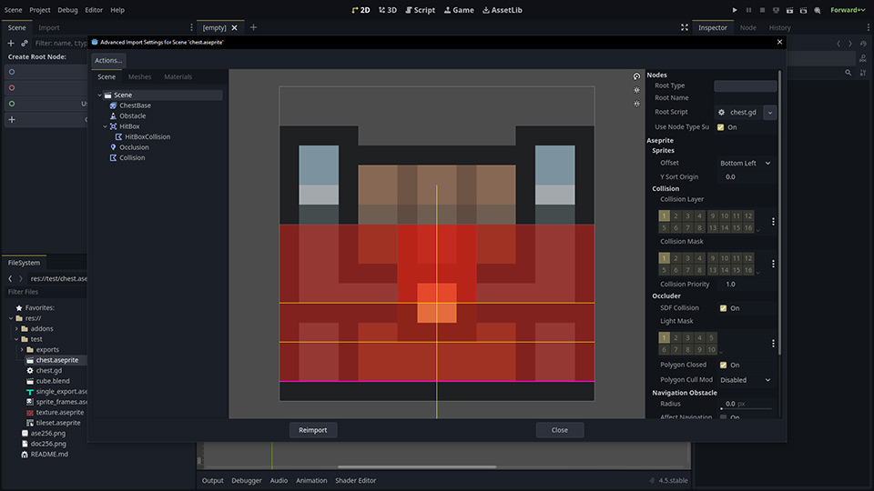

# Godot Aseprite

<p align="center"></p>

Aseprite file parser for Godot Engine.

## Importer

The plugin includes an importer.
It support importing `.aseprite` files as scene files using the dedicated advanced importer found in Godot.

<p align="center"></p>

The scene importer is pretty powerful, although incomplete, it allows to import sprites, animated sprites, collision shapes, light occlusion polygons, navigation polygons, Area2D with collision, custom attached script, etc.

The importers have the ability to save to file the images as external resources.
Saving the images as external resources is usefull for debugging, you want to re-use the image somewhere else, or manually choose the import options such as compression, mipmaps, etc.

### Texture importer

Import a `.aseprite` file as a texture.

- [x] Save the texture to an external `.png` file.

### Sprite frames importer

Import a `.aseprite` file as a `SpriteFrames`.
The importer will read the tags and create an animation for each tag.
The animation duration is computed by averaging the duration of each frame in the tag.

- [x] Save the texture to an external `.png` file.
- [ ] Frame animation duration per frame is not implemented.
- [ ] Linked cels are not supported.

### Limitations

The importer have some shortcomings:

- Does not support layer opacity. _This one is a pretty big deal._
- Does not support layer blend modes other than normal.
- Does not fully support texture packing, it will generate a texture for each layer, animated sprites and tilemaps are sort of packed.
- No texture trim, if the canvas is 100x100 and the sprite is 10x10, the texture will be 100x100 with a lot of transparent pixels.

## AsepriteFile class

Aseprite file parser for Godot Engine.

```gdscript
var ase := AsepriteFile.open("res://path/to/file.aseprite")
if ase == null:
    push_warning("Failed to open: %s" % error_string(AsepriteFile.get_open_error()))
    return
```

The script is in a single GDScript file [addons/aseprite_file/aseprite_file.gd](addons/aseprite_file/aseprite_file.gd)

You can use it as a plugin or copy the file in your project.

## Supported Chunks
- [x] Layer Chunk [0x2004]
- [x] Cel Chunk [0x2005]
- [x] Cel Extra Chunk [0x2006]
- [x] Color Profile Chunk [0x2007]
- [x] External Files Chunk [0x2008]
- [x] Tags Chunk [0x2018]
- [x] Palette Chunk [0x2019]
- [ ] User Data Chunk [0x2020]
- [x] Slice Chunk [0x2022]
- [x] Tileset Chunk [0x2023]

### Legacy chunks

After version v1.1 (Aug 2015), Aseprite introduced a new palette chunk (0x2019) that supports more than 256 colors.
Legacy chunks are still saved for backward compatibility.
https://blog.aseprite.org/2015/08/21/aseprite-v11-released/

Legacy chunks are not supported to reduce complexity as practically they are not used anymore.

- [ ] Old palette chunk (0x0004)
- [ ] Old palette chunk (0x0011)

### Deprecated chunks

Deprecated chunks are present in the spec but unused by Aseprite.

- [ ] Mask Chunk (0x2016) DEPRECATED
- [ ] Path Chunk (0x2017) Never used

## Security note

Be careful using this parser for untrusted files, especially if you plan to use it for network shared resources.

The .aseprite format can be used to store filenames, potentially leaking personal info.

A malicious file could also contain a large amount of transparent pixels, when uncompressed, it could take a lot of memory.
Transparent pixels can be compressed efficiently, the raw data is `w * h * color_depth`, on very large image dimensions, this could lead to the uncompressed data being very large.

~~This parser is vulnerable to gzip bombs as `decompress_dynamic` calls are unbounded (`-1`).~~

~~The compression format used by Aseprite is ZLIB; it does not store the uncompressed size of the deflated buffer. Without this information, it is not possible to know at runtime how large the uncompressed buffer will be.~~

~~A heuristic could be implemented to limit this class of attacks, `compressed_size * 5.7` is a good estimate, exceeding an order of magnitude is likely a malformed file. A compression rate of `10:1` is extreme for images.~~

Edit: This parser is **NOT** vulnerable to gzip bombs, it turns out I already contradicted myself in the code, the `decompress_dynamic` call has been replaced with `decompress` with the appropriate expected size.

## Aseprite file format specification

The Aseprite file format specification is available here:

https://github.com/aseprite/aseprite/blob/main/docs/ase-file-specs.md
